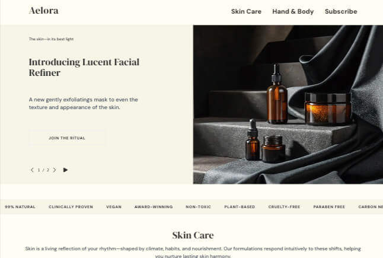

# Aelora – Skincare Inspired by Nature 🌿

**Aelora** is a conceptual landing page for a natural skincare brand.  
It was built with a focus on visual aesthetics, smooth interaction, calm UX, and modern frontend technologies.

> _"Let care arrive quietly."_ — The philosophy of Aelora is reflected in its code, layout, and attention to detail.

---

## 🌐 Live Demo

💻  [aelora.vercel.app](https://aelora.vercel.app)



---

## 🛠 Tech Stack

- [Next.js 15 (App Router)](https://nextjs.org/)
- [Tailwind CSS](https://tailwindcss.com/)
- [Framer Motion](https://www.framer.com/motion/)
- [React Hook Form](https://react-hook-form.com/)
- [Supabase](https://supabase.io/) – for anonymous newsletter subscription
- [TypeScript](https://www.typescriptlang.org/)

---

## 🎯 Features

- ✅ Responsive, spacious layout with modern UI
- ✅ Smooth content animations and transitions
- ✅ UX-validated newsletter subscription form
- ✅ SEO and OpenGraph metadata included
- ✅ Accessibility (a11y): semantic structure, tab focus, ARIA roles
- ✅ Lazy-loaded via next/dynamic for better LCP

---

## 📌 Project Goal

To create a showcase UI case for a frontend UI engineer portfolio, with a focus on:

- 🎨 Carefully structured, aesthetic layout
- 🧱 Component-based and modular architecture
- 💨 Smooth and lightweight implementation with minimal overhead

This project emphasizes attention to detail, visual balance, and modern frontend practices.

---

## 📁 Project Structure

app/
page.tsx // main page
layout.tsx // shared layout
components/ // reusable blocks
data/ // product and gallery data
public/
images/ // product images and og-preview.jpg


---

## ✨ Inspiration

- [Aesop](https://www.aesop.com/) — as a visual and tone reference
- Natural textures, soft light, and respectful use of whitespace
- A brand that speaks through care — both in design and code

---

## 🎨 UI Highlights

- Strategic use of whitespace and layout rhythm for visual lightness
- Custom color palette: `graphite`, `clay`, `linen`
- Smooth fade-in animations via `Framer Motion`
- Balanced typography using `DM Serif Display` + `DM Sans`

---

## 🧪 Performance

Optimized for Core Web Vitals:

- ✅ LCP: 1.4 s (via Lighthouse)
- ✅ FCP: 1.0 s
- ✅ CLS: 0
- ✅ TBT: 60 ms

---

## 🚀 Deployment

Deployed via [Vercel](https://vercel.com/)

```bash
# Local development
npm install
npm run dev
```
Open (http://localhost:3000) in your browser to see the result.

## 📬 Контакты

**Galyna Krupska**  
Frontend / UI Developer  

📧 galynakrupska9@gmail.com  
🌐 [LinkedIn](hhttps://www.linkedin.com/in/galyna-krupska-398a3729/)  
